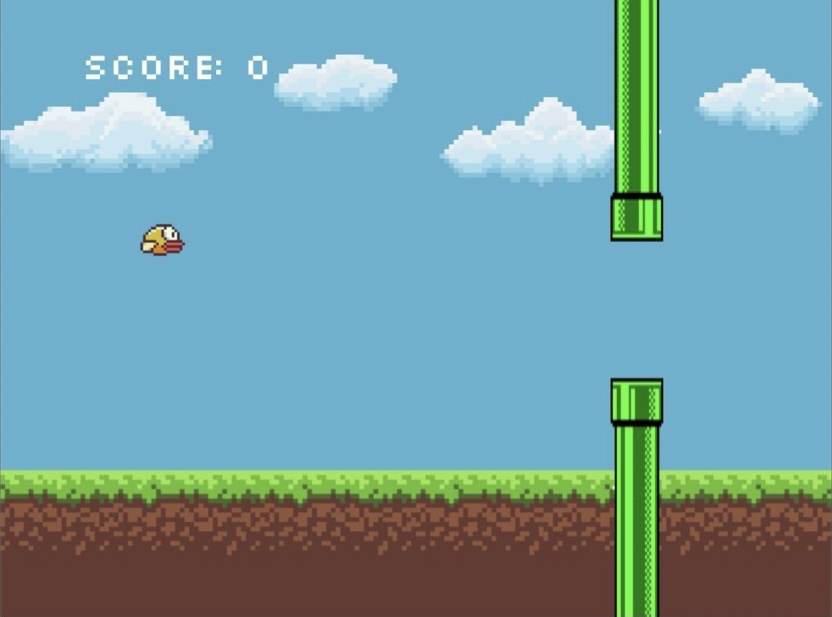

---
#  SWEN20003 Project 2 
This repository is created for Swen20003 Project2 Semester 2 2021
---
---
## **OOSD Project2  Flapping Bird**

---
Flappy Bird is a game where you, as the player, controls a bird by pressing the space bar (or tapping the screen on touchscreen devices) and attempts to fly the bird between pairs of pipes.

---
# Design Class Diagram of the implementations
 

